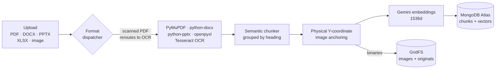
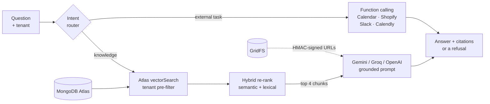

<div align="center">
  
# 🧠 Multi-Tenant RAG Engine
### Enterprise-Grade, Media-Aware Retrieval-Augmented Generation

[](https://python.org)
[](https://flask.palletsprojects.com/)
[](https://mongodb.com)
[](https://ai.google.dev/)
[](#-hybrid-retrieval-grounded-generation)
[](#-app-integration-ecosystem)

[](https://multi-tenant-rag-engine.vercel.app)


A professional-grade, scalable RAG pipeline engineered to handle multiple distinct knowledge bases simultaneously. Built for precision, it features a **"Physical-First"** image mapping strategy to guarantee pixel-perfect alignment between retrieved text and its associated media. Beyond basic RAG, this engine serves as a dynamic AI hub capable of interfacing with a range of external tools and APIs via native LLM function calling.

[Live Demo](https://multi-tenant-rag-engine.vercel.app) • [Explore Features](#-core-innovations) • [The Workspace](#-the-demo-workspace) • [Integration Ecosystem](#-app-integration-ecosystem) • [View Architecture](#-system-architecture) • [Getting Started](#-quick-start) • [Deployment](#-deployment)


</div>
---
## ✨ Core Innovations

### 🏢 True Multi-Tenancy
Build once, serve many. The architecture uses strict `project_id` / `knowledge_base_id` boundaries. A single unified engine can securely power a "Travel Guide" for tourism, a "Property Agent" for real estate, and a "Health Assistant" for hospitals — each with isolated data, its own guardrails, and a customized AI persona — with no code changes per tenant.

### 📍 Physical-First Image Mapping
Traditional PDF parsers lose context when extracting images. A custom algorithm records the exact **Y-Coordinate** of every heading and image, then dynamically "anchors" each image to the text physically appearing above it — eliminating the "leaking images" problem where media ends up attached to the wrong section.

### 🎯 Hybrid Retrieval, Grounded Generation
Retrieval runs on Gemini `gemini-embedding-001` vectors through MongoDB Atlas Vector Search, with tenant isolation enforced **inside** the `$vectorSearch` stage via a native pre-filter — so a large tenant can never crowd a smaller one out of the candidate pool. Candidates are then re-ranked by blending semantic similarity with lexical overlap, which recovers exact-identifier matches (product codes, proper nouns, numbers) that pure dense retrieval tends to miss — without the latency of a cross-encoder. Generation runs on Gemini `gemini-2.5-flash` behind a strict grounding prompt: answer only from retrieved context, refuse in the user's own detected language when the answer isn't in the knowledge base, never fall back on outside knowledge.

Generation is pluggable via `LLM_PROVIDER` (`gemini` | `groq` | `openai`); Groq and OpenAI share a single code path, since Groq speaks the OpenAI chat-completions dialect and differs only in endpoint, key, and model.

Embeddings, by contrast, are pinned to Gemini no matter which provider generates. Vectors from different models occupy different spaces, so letting embeddings follow the generation provider would silently invalidate every indexed chunk the moment you switched — old vectors return confident nonsense rather than failing loudly. Pinning them means a generation-side outage or quota cap never touches the corpus.

The default is `gemini` for a practical reason: a single RAG call spends roughly 9k tokens on retrieved context, and Groq's free tier allows 12k tokens per minute — enough to rate-limit after about one query every 45 seconds. Gemini's free tier is roughly 250k tokens per minute, which is the difference between a demo that survives an audience and one that doesn't.

### 📄 Multi-Format Ingestion
One dispatcher routes each upload to a format-specific parser, all normalizing to a single layout shape so chunking, image anchoring, embedding, and storage stay format-agnostic:

| Format | Parser | Heading strategy |
|---|---|---|
| PDF | PyMuPDF | Font-size heuristics vs. document median |
| DOCX | python-docx | Semantic styles, with a bold/size fallback for directly-formatted headings |
| PPTX | python-pptx | Slide title placeholder; speaker notes included |
| XLSX | openpyxl | Sheet-per-topic; rows serialized as `Header: value` pairs |
| Images | Tesseract OCR | Single OCR'd block |

Scanned PDFs are detected automatically (near-zero extractable text per page) and routed through OCR rather than silently ingesting as an empty knowledge base.

---

## 🖥️ The Demo Workspace

[**multi-tenant-rag-engine.vercel.app**](https://multi-tenant-rag-engine.vercel.app) — no key, no signup.

RAG systems are usually judged on the answer alone, which is exactly the part that reveals nothing about whether retrieval worked. The workspace in `ui/` shows the intermediate state instead:

| View | What it exposes |
|---|---|
| **Chat** | The answer, alongside every retrieved candidate with its vector score, keyword score and blended rank — and which four were actually sent to the model |
| **Document** | The original PDF the answer was grounded in, streamed from GridFS, so citations can be checked against the source |
| **RAG on/off** | The same question answered with and without retrieval, side by side — the clearest demonstration of what grounding is for |
| **Chunks** | How a document was split, the heading hierarchy that drove the split, and which images anchored where |
| **Vector space** | A 2-D projection of the tenant's embeddings, with the query plotted into the same space |
| **Evaluation** | Hit@1 / Hit@3 / MRR for vector-only vs. hybrid retrieval, run live against the stored eval set |
| **Upload** | Your own document becomes a temporary tenant, queryable immediately, expiring after 6 hours |

**Run demo** in the toolbar does the whole thing in one click: selects the flagship tenant, asks one of its sample questions, and runs the pipeline with the inspector filling in beside it.

The demo API (`demo_api.py`) is deliberately unauthenticated — requiring a key to look at a demo defeats the point. Safety comes from scope instead: the routes only ever touch projects explicitly flagged `isDemo`, every route carries a rate limit priced to what it costs to serve, and visitor uploads land in ephemeral projects that expire.

---

## 🔗 App Integration Ecosystem

The RAG Engine isn't just about reading documents — it's designed to take action. A registry-driven function-calling layer lets each tenant's bot decide, per query, whether to answer from the knowledge base or invoke a connected third-party action:

- 📅 **Scheduling:** Google Calendar, Calendly
- 🛒 **E-Commerce:** Shopify
- 💬 **Communication:** Slack

Tools are built dynamically per tenant from whichever integrations that project has connected (OAuth or API key, credentials encrypted at rest) — nothing is hardcoded per integration; adding a new one is a registry entry, not new routing logic.

---

## 🏗️ System Architecture

**Ingestion** — one dispatcher, five parsers, a single normalized layout shape downstream:



**Query** — retrieval is tenant-scoped inside the search, and generation only ever sees retrieved context:



---

## 🚀 Quick Start

### Prerequisites
- Python 3.11+
- MongoDB Atlas cluster with a Vector Search index named `vector_index` on `chunks` (see Production Notes for the exact definition)
- Google Gemini API key ([free](https://aistudio.google.com/apikey)) — embeddings, and generation on the default `LLM_PROVIDER=gemini`
- Optionally a Groq ([free](https://console.groq.com/keys)) or OpenAI key, if you switch generation providers

### 1. Installation
```bash
git clone https://github.com/shlokdhanokar/MultiTenant-RAG-Engine.git
cd MultiTenant-RAG-Engine
pip install -r requirements.txt
```

### 2. Configuration
Copy `.env.example` to `.env` and fill in your own values:
```bash
cp .env.example .env
```
At minimum you need `MONGODB_URI`, `MONGODB_DB_NAME`, and `GEMINI_API_KEY`.

Full deployment instructions are in [DEPLOY.md](DEPLOY.md).

### 3. Launch the Server
```bash
python server.py
```
> The server starts locally on `http://localhost:8000`. For production, run it under Gunicorn (see `Dockerfile`) instead of the Flask dev server.

### 4. Launch the UI (optional)
```bash
cd ui && npm install && npm run dev     # http://localhost:5173
```
Seed the demo knowledge bases first with `python scripts/seed_demo.py`, or the workspace opens with nothing to query.

---

## 🌐 Deployment

Three topologies are documented in [DEPLOY.md](DEPLOY.md); the live demo runs the third:

```
visitor ──▶ Vercel (static UI + rewrites) ──▶ nginx ──▶ gunicorn ──▶ MongoDB Atlas
             *.vercel.app, TLS               Oracle Always Free VM     + Gemini
```

Vercel serves the compiled bundle and reverse-proxies the API paths to the origin, so the browser only ever talks to one origin — no CORS, no mixed content, and no dependence on the origin's hostname resolving on the visitor's network. The origin is a single Oracle Cloud Always Free instance provisioned by [`terraform/`](terraform/), with `deploy.sh` installing the service, nginx, TLS and dynamic DNS end to end.

---

## 🔌 API Reference

All routes below (except `/admin/register` and `/health`) require an API key header. There are two tiers:
- **Master Key** (`apikey` header, `sk_master_...`) — tenant/admin-level operations.
- **Project Key** (`x-apikey` header, `sk_proj_...`) — chat/upload operations scoped to one knowledge base.

### 🏢 1. Register a Tenant
`POST /admin/register`
```json
{ "companyName": "Acme Clinic", "companyPersona": "A friendly medical assistant" }
```
Returns your Master Key — store it securely, it's shown once.

### 📁 2. Create a Project (Knowledge Base)
`POST /admin/project` — header: `apikey: <master key>`
```json
{
  "projectName": "Patient FAQ Bot",
  "projectInstruction": "You are a helpful assistant for Acme Clinic.",
  "projectGuardrails": "Never give medical diagnoses.",
  "buttons": []
}
```
Returns a Project Key scoped to this knowledge base.

### 📤 3. Ingest a Document
`POST /upload/document` — header: `x-apikey: <project key>`
- **Content-Type**: `multipart/form-data`
- **Body**: `file` — a PDF, DOCX, PPTX, XLSX, or image file to ingest into this project's knowledge base.
- Max upload size: 25 MB. `POST /upload/pdf` remains as an alias for backward compatibility.

### 💬 4. Query the Engine
`POST /chat/v2` — header: `x-apikey: <project key>`
```json
{
  "query": "Is scuba available at your resort?",
  "phone": "+15551234567"
}
```
`POST /chat/v3` returns the same answer in a richer, WhatsApp-session-message format (text/image/interactive list/quick reply).

### 🖼️ 5. Fetch Media
`GET /image/<image_id>?exp=<expiry>&sig=<hmac>`

Serves images stored in MongoDB GridFS via a short-lived HMAC-signed URL. WhatsApp's servers fetch these directly and can't send an auth header, so the link itself is signed and expires (24h) instead. URLs are generated automatically inside chat responses — you shouldn't need to construct one by hand.

### 📊 6. Usage & Cost
`GET /admin/usage` — header: `apikey: <master key>`

Per-project token usage and estimated spend, aggregated from stored chat history. Optional `?project_id=<id>` to scope to one project.

### 🔓 7. Public Demo API

`GET|POST /api/demo/*` — no key required, scoped to projects flagged `isDemo`.

| Route | Purpose |
|---|---|
| `GET /stats` · `GET /tenants` | Models in use, and the demo knowledge bases |
| `POST /chat` | Answer plus the full retrieval trace: candidates, scores, stage timings, token cost |
| `POST /compare` | The same question with and without retrieval |
| `GET /chunks/<project_id>` | Chunk boundaries, headings, anchored images |
| `GET /documents/<project_id>` · `GET /document/<project_id>/<file>` | Source-document list, and the original file streamed from GridFS |
| `GET /projection/<project_id>` · `POST /projection/<project_id>/query` | 2-D embedding projection, and a query plotted into it |
| `GET /eval/<project_id>` | Hit@1 / Hit@3 / MRR, vector-only vs. hybrid |
| `POST /upload` | Ingest a visitor document into an ephemeral tenant |

Document access is scoped by project rather than by GridFS id: an id alone would let a visitor pull any file in the bucket, including another tenant's upload.

---

## 🧪 Retrieval Evaluation

Retrieval quality is measured, not assumed. The harness runs a hand-written question set against the live pipeline and reports Hit@1 / Hit@3 / MRR for vector-only vs. hybrid re-ranked retrieval:

```bash
python eval/run_eval.py                       # default tourism eval set
python eval/run_eval.py --keyword-weight 0.5  # sweep the hybrid blend
```

Add a new eval set by copying `eval/eval_set_tourism.json` and pointing `knowledge_base_id` at your project.

---

## ⚙️ Production Notes

- **Run under Gunicorn**, not the Flask dev server — see `Dockerfile`.
- **Rate limits** are priced per endpoint: 5/hr on tenant registration, 30/min per project key on chat, 20/hr on uploads, and a separate per-route set on the public demo API (3/hr on `/api/demo/upload`, 10/min on `/api/demo/chat`, and so on). Counters live in MongoDB by default — with in-process storage each Gunicorn worker keeps its own, so every limit is silently multiplied by the worker count. Override with `RATELIMIT_STORAGE_URI`.
- **Set `CORS_ORIGINS`** on any public deployment. It defaults to `*`, which lets any site spend your provider quota from its own visitors' browsers — and spreads those calls across enough addresses to stay under the per-caller limits.
- **Behind a proxy, `ProxyFix` matters.** Without it Flask sees the proxy's address as the client for every request and the rate limits collapse into one bucket shared by everyone. See [SECURITY_IMPLEMENTATION.md](SECURITY_IMPLEMENTATION.md#rate-limiting-and-caller-identity).
- **Atlas index**: the `vector_index` on `chunks` must declare `embedding` as a `vector` field *and* `knowledge_base_id` as a `filter` field, or tenant pre-filtering will not work. `numDimensions` must match `GEMINI_EMBEDDING_DIMENSIONS`:
  ```json
  {
    "fields": [
      { "type": "vector", "path": "embedding", "numDimensions": 1536, "similarity": "cosine" },
      { "type": "filter", "path": "knowledge_base_id" }
    ]
  }
  ```
- **Changing embedding model or dimensions invalidates every stored chunk.** Embeddings from different models occupy different vector spaces, so old vectors return confident nonsense rather than failing loudly. Re-ingest all documents after any such change — see `scripts/reset_for_gemini.py`.
- **OCR** requires the `tesseract-ocr` system package (installed in the Docker image). Without it the app still runs; image/scanned-PDF ingestion degrades gracefully.

---

<div align="center">
  <p>Engineered with ❤️ by <b>Shlok Dhanokar</b></p>
</div>
