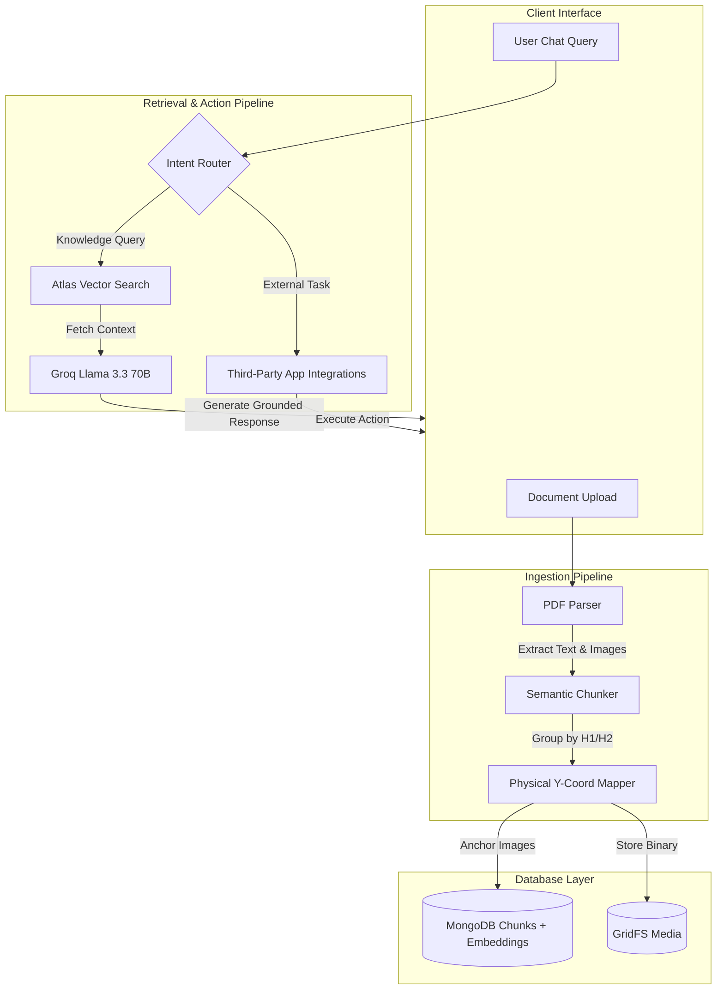

<div align="center">
  
# 🧠 Multi-Tenant RAG Engine
### Enterprise-Grade, Media-Aware Retrieval-Augmented Generation

[](https://python.org)
[](https://flask.palletsprojects.com/)
[](https://mongodb.com)
[](https://groq.com/)
[](https://ai.google.dev/)
[](#-app-integration-ecosystem)

A professional-grade, scalable RAG pipeline engineered to handle multiple distinct knowledge bases simultaneously. Built for precision, it features a **"Physical-First"** image mapping strategy to guarantee pixel-perfect alignment between retrieved text and its associated media. Beyond basic RAG, this engine serves as a dynamic AI hub capable of interfacing with a range of external tools and APIs via native LLM function calling.

[Explore Features](#-core-innovations) • [Integration Ecosystem](#-app-integration-ecosystem) • [View Architecture](#-architecture) • [Getting Started](#-quick-start)


</div>
---
## ✨ Core Innovations

### 🏢 True Multi-Tenancy
Build once, serve many. The architecture uses strict `project_id` / `knowledge_base_id` boundaries. A single unified engine can securely power a "Travel Guide" for tourism, a "Property Agent" for real estate, and a "Health Assistant" for hospitals — each with isolated data, its own guardrails, and a customized AI persona — with no code changes per tenant.

### 📍 Physical-First Image Mapping
Traditional PDF parsers lose context when extracting images. A custom algorithm records the exact **Y-Coordinate** of every heading and image, then dynamically "anchors" each image to the text physically appearing above it — eliminating the "leaking images" problem where media ends up attached to the wrong section.

### 🎯 Hybrid Retrieval, Grounded Generation
Retrieval runs on Gemini `gemini-embedding-001` vectors through MongoDB Atlas Vector Search, with tenant isolation enforced **inside** the `$vectorSearch` stage via a native pre-filter — so a large tenant can never crowd a smaller one out of the candidate pool. Candidates are then re-ranked by blending semantic similarity with lexical overlap, which recovers exact-identifier matches (product codes, proper nouns, numbers) that pure dense retrieval tends to miss — without the latency of a cross-encoder. Generation runs on Groq `llama-3.3-70b-versatile` behind a strict grounding prompt: answer only from retrieved context, refuse in the user's own detected language when the answer isn't in the knowledge base, never fall back on outside knowledge.

The two halves are deliberately split across providers. Generation is pluggable via `LLM_PROVIDER` (`groq` | `gemini`), but embeddings are pinned to Gemini — vectors from different models occupy different spaces, so letting embeddings follow the generation provider would silently invalidate every indexed chunk on a switch. Pinning them means a generation-side outage or quota cap never touches the corpus.

### 📄 Multi-Format Ingestion
One dispatcher routes each upload to a format-specific parser, all normalizing to a single layout shape so chunking, image anchoring, embedding, and storage stay format-agnostic:

| Format | Parser | Heading strategy |
|---|---|---|
| PDF | PyMuPDF | Font-size heuristics vs. document median |
| DOCX | python-docx | Semantic styles, with a bold/size fallback for directly-formatted headings |
| PPTX | python-pptx | Slide title placeholder; speaker notes included |
| XLSX | openpyxl | Sheet-per-topic; rows serialized as `Header: value` pairs |
| Images | Tesseract OCR | Single OCR'd block |

Scanned PDFs are detected automatically (near-zero extractable text per page) and routed through OCR rather than silently ingesting as an empty knowledge base.

---

## 🔗 App Integration Ecosystem

The RAG Engine isn't just about reading documents — it's designed to take action. A registry-driven function-calling layer lets each tenant's bot decide, per query, whether to answer from the knowledge base or invoke a connected third-party action:

- 📅 **Scheduling:** Google Calendar, Calendly
- 🛒 **E-Commerce:** Shopify
- 💬 **Communication:** Slack

Tools are built dynamically per tenant from whichever integrations that project has connected (OAuth or API key, credentials encrypted at rest) — nothing is hardcoded per integration; adding a new one is a registry entry, not new routing logic.

*Note: an additional conversational-commerce module (checkout over a custom marketplace API) exists in `phase4_integrations/marketplace_*` but is intentionally disabled (`MARKETPLACE_ENABLED=false`) — it belongs to a separate product and is out of scope for this engine.*

---

## 🏗️ System Architecture



---

## 🚀 Quick Start

### Prerequisites
- Python 3.11+
- MongoDB Atlas cluster with a Vector Search index named `vector_index` on `chunks` (see Production Notes for the exact definition)
- Groq API key ([free](https://console.groq.com/keys)) — generation
- Google Gemini API key ([free](https://aistudio.google.com/apikey)) — embeddings (required even on Groq)

### 1. Installation
```bash
git clone https://github.com/shlokdhanokar/MultiTenant-RAG-Engine.git
cd MultiTenant-RAG-Engine
pip install -r requirements.txt
```

### 2. Configuration
Copy `.env.example` to `.env` and fill in your own values:
```bash
cp .env.example .env
```
At minimum you need `MONGODB_URI`, `MONGODB_DB_NAME`, `GROQ_API_KEY`, and `GEMINI_API_KEY`.

Full deployment instructions are in [DEPLOY.md](DEPLOY.md).

### 3. Launch the Server
```bash
python server.py
```
> The server starts locally on `http://localhost:8000`. For production, run it under Gunicorn (see `Dockerfile`) instead of the Flask dev server.

---

## 🔌 API Reference

All routes below (except `/admin/register` and `/health`) require an API key header. There are two tiers:
- **Master Key** (`apikey` header, `sk_master_...`) — tenant/admin-level operations.
- **Project Key** (`x-apikey` header, `sk_proj_...`) — chat/upload operations scoped to one knowledge base.

### 🏢 1. Register a Tenant
`POST /admin/register`
```json
{ "companyName": "Acme Clinic", "companyPersona": "A friendly medical assistant" }
```
Returns your Master Key — store it securely, it's shown once.

### 📁 2. Create a Project (Knowledge Base)
`POST /admin/project` — header: `apikey: <master key>`
```json
{
  "projectName": "Patient FAQ Bot",
  "projectInstruction": "You are a helpful assistant for Acme Clinic.",
  "projectGuardrails": "Never give medical diagnoses.",
  "buttons": []
}
```
Returns a Project Key scoped to this knowledge base.

### 📤 3. Ingest a Document
`POST /upload/document` — header: `x-apikey: <project key>`
- **Content-Type**: `multipart/form-data`
- **Body**: `file` — a PDF, DOCX, PPTX, XLSX, or image file to ingest into this project's knowledge base.
- Max upload size: 25 MB. `POST /upload/pdf` remains as an alias for backward compatibility.

### 💬 4. Query the Engine
`POST /chat/v2` — header: `x-apikey: <project key>`
```json
{
  "query": "Is scuba available at your resort?",
  "phone": "+15551234567"
}
```
`POST /chat/v3` returns the same answer in a richer, WhatsApp-session-message format (text/image/interactive list/quick reply).

### 🖼️ 5. Fetch Media
`GET /image/<image_id>?exp=<expiry>&sig=<hmac>`

Serves images stored in MongoDB GridFS via a short-lived HMAC-signed URL. WhatsApp's servers fetch these directly and can't send an auth header, so the link itself is signed and expires (24h) instead. URLs are generated automatically inside chat responses — you shouldn't need to construct one by hand.

### 📊 6. Usage & Cost
`GET /admin/usage` — header: `apikey: <master key>`

Per-project token usage and estimated spend, aggregated from stored chat history. Optional `?project_id=<id>` to scope to one project.

---

## 🧪 Retrieval Evaluation

Retrieval quality is measured, not assumed. The harness runs a hand-written question set against the live pipeline and reports Hit@1 / Hit@3 / MRR for vector-only vs. hybrid re-ranked retrieval:

```bash
python eval/run_eval.py                       # default tourism eval set
python eval/run_eval.py --keyword-weight 0.5  # sweep the hybrid blend
```

Add a new eval set by copying `eval/eval_set_tourism.json` and pointing `knowledge_base_id` at your project.

---

## ⚙️ Production Notes

- **Run under Gunicorn**, not the Flask dev server — see `Dockerfile`.
- **Rate limits**: 5/hr on tenant registration, 30/min per project key on chat, 20/hr on uploads. Limiter state is in-memory; switch `storage_uri` to Redis if you run more than one instance.
- **Atlas index**: the `vector_index` on `chunks` must declare `embedding` as a `vector` field *and* `knowledge_base_id` as a `filter` field, or tenant pre-filtering will not work. `numDimensions` must match `GEMINI_EMBEDDING_DIMENSIONS`:
  ```json
  {
    "fields": [
      { "type": "vector", "path": "embedding", "numDimensions": 1536, "similarity": "cosine" },
      { "type": "filter", "path": "knowledge_base_id" }
    ]
  }
  ```
- **Changing embedding model or dimensions invalidates every stored chunk.** Embeddings from different models occupy different vector spaces, so old vectors return confident nonsense rather than failing loudly. Re-ingest all documents after any such change — see `scripts/reset_for_gemini.py`.
- **OCR** requires the `tesseract-ocr` system package (installed in the Docker image). Without it the app still runs; image/scanned-PDF ingestion degrades gracefully.

---

<div align="center">
  <p>Engineered with ❤️ by <b>Shlok Dhanokar</b></p>
</div>
