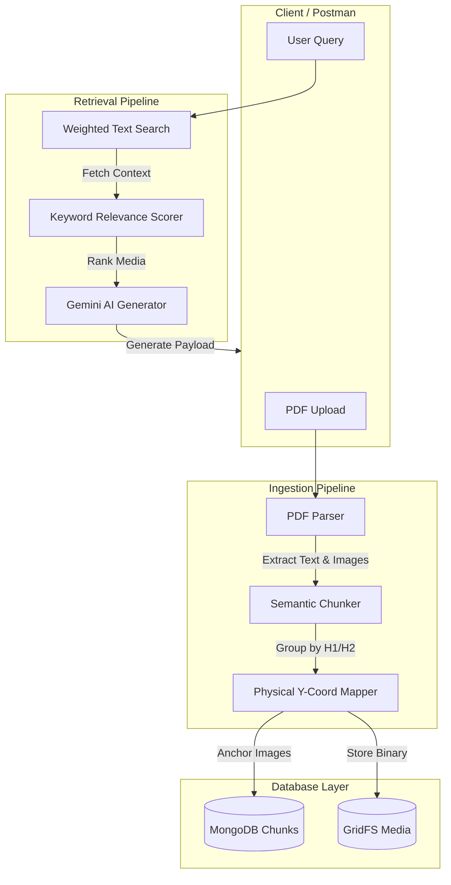

<div align="center">
  
# 🧠 Multi-Tenant RAG Engine
### High-Precision, Media-Aware Retrieval-Augmented Generation

[](https://python.org)
[](https://flask.palletsprojects.com/)
[](https://mongodb.com)
[](https://ai.google.dev/)

A professional-grade, scalable RAG pipeline engineered to handle multiple distinct knowledge bases simultaneously. It features a revolutionary **"Physical-First"** image mapping strategy to guarantee pixel-perfect alignment between retrieved text and its associated media.

[Explore Features](#-core-innovations) • [View Architecture](#-architecture) • [Getting Started](#-quick-start)

</div>
---


## ✨ Core Innovations

### 🏢 True Multi-Tenancy
Build once, serve many. Our architecture uses strict `knowledge_base_id` boundaries. A single unified engine can securely power a "Travel Guide" for tourism, a "Property Agent" for real estate, and a "Health Assistant" for hospitals—all with fully isolated data and customized AI personas.

### 📍 Physical-First Image Mapping
Traditional PDF parsers lose context when extracting images. We built a custom algorithm that records the exact **Y-Coordinate** of every heading and image. Images are dynamically "anchored" to the text physically appearing above them, entirely eliminating the "leaking images" problem.

### 🎯 Keyword-Scored Retrieval
We don't just rely on standard vector or text search. Images are re-ranked in real-time based on **query keyword density** within their parent chunks, ensuring the most semantically relevant media is always prioritized.

---

## 🏗️ System Architecture



---

## 🚀 Quick Start

### Prerequisites
- Python 3.9+
- MongoDB Atlas cluster
- Google Gemini API Key

### 1. Installation
Clone the repository and install dependencies:
```bash
git clone https://github.com/shlokdhanokar/MultiTenant-RAG-Engine.git
cd MultiTenant-RAG-Engine
pip install -r requirements.txt
```

### 2. Configuration
Create a `.env` file in the project root:
```env
MONGODB_URI=your_mongodb_atlas_connection_string
MONGODB_DB_NAME=rag_db
GOOGLE_API_KEY=your_gemini_api_key
```

### 3. Launch the Server
```bash
python server.py
```
> The server will start on `http://localhost:8000`

---

## 🔌 API Reference

### 📤 1. Ingest Knowledge Base
`POST /upload/pdf`

Upload a PDF and assign it to a specific tenant.
- **Content-Type**: `multipart/form-data`
- **Body**:
  - `file`: (File) The PDF document.
  - `knowledge_base_id`: (Text) e.g., `tourism`

### 💬 2. Query the Engine
`POST /chat`

Retrieve context-aware AI answers with injected media and interactive buttons.
- **Content-Type**: `application/json`
- **Body**:
  ```json
  {
      "query": "Is scuba available at your resort?",
      "knowledge_base_id": "tourism"
  }
  ```

### 🖼️ 3. Fetch Media
`GET /image/<image_id>`

Directly serve high-resolution images stored in MongoDB GridFS.

---

<div align="center">
  <p>Engineered with ❤️ by <b>Shlok Dhanokar</b></p>
</div>
